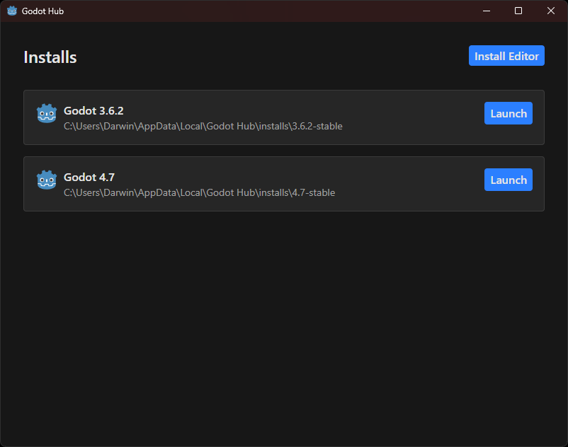

# Godot Hub

[](https://github.com/darwinbillian/godot-hub/releases)
[](./LICENSE)
[](https://github.com/darwinbillian/godot-hub/commits/main/)

Godot Hub is a desktop application for managing multiple versions of the [Godot Engine](https://godotengine.org/).



## Features

- **Version Management:** Download, manage, and launch different versions of the Godot Engine.
- **Lightweight and Fast:** Powered by Tauri.

## Installation

### Build from Source

- **Install the following dependencies:**

  - Node.js
  - Rust

- **Build the application:**

  ```sh
  git clone --depth 1 https://github.com/darwinbillian/godot-hub.git
  cd godot-hub
  npm install
  npm run tauri build
  ```

- **Install the application:**

  Run the installer generated in `src-tauri/target/release/bundle/nsis`.

## License

This project is licensed under the [GNU General Public License v3.0](./LICENSE).
