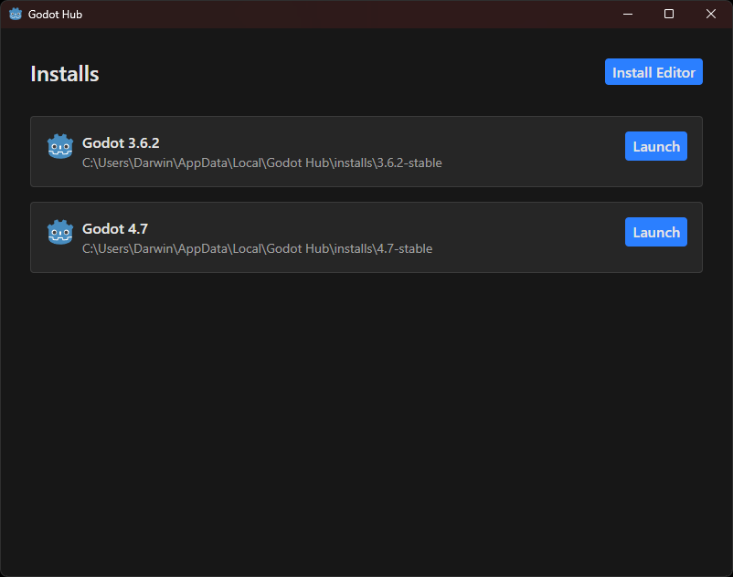

# Godot Hub

[](https://github.com/darwinbillian/godot-hub/releases)
[](./LICENSE)
[](https://github.com/darwinbillian/godot-hub/commits/main/)

Godot Hub is a cross-platform desktop application for managing multiple versions
of [Godot](https://godotengine.org/).



## Features

- **Version Management:** Download, manage, and launch different versions of the
  Godot Engine.
- **Cross Platform:** Available on Linux and Windows.

## Installation

### Linux

#### Debian

Download and install the
[latest](https://github.com/darwinbillian/godot-hub/releases/latest) `.deb`
package.

#### Fedora

Download and install the
[latest](https://github.com/darwinbillian/godot-hub/releases/latest) `.rpm`
package.

#### AppImage

Download the
[latest](https://github.com/darwinbillian/godot-hub/releases/latest) `.AppImage`
package.

### Windows

Download and run the
[latest](https://github.com/darwinbillian/godot-hub/releases/latest) `.exe`
installer.

## Development

Install [Tauri prerequisites](https://v2.tauri.app/start/prerequisites/), and
then run the application:

```sh
git clone https://github.com/darwinbillian/godot-hub.git
cd godot-hub
npm ci
npm run tauri dev
```

To build the application:

```sh
npm run tauri build
```

## License

This project is licensed under the [GNU General Public License v3.0](./LICENSE).
